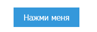
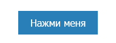
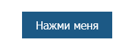
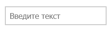
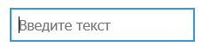
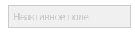
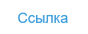
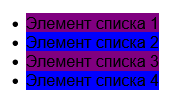
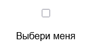
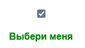

# Стилизация элементов с использованием псевдоклассов

## Срок сдачи работ

Последний коммит и пул реквест должен быть оформлен до ???

## Цель:

Используя только CSS, оформить UI элементы исходя из их состояния

### Использованные цвета

#3498db, #2980b9, #1c5985, #ccc, #f0f0f0, #aaa

## Элементы

1. Кнопка

_В обычном состоянии_

_Навели на кнопку_

_Нажали на кнопку_

2. Поле ввода

_В обычном состоянии_

_Поле ввода активно_

_Поле ввода отключено_

3. Список

_По ссылке не переходили_

_Юзер уже переходил по ссылке_

4. Лист

5. Чекбокс

## Как сдавать

1. Создайте форк репозитория в организации `21ISR` с названием `uidev-lab7-вашафамилия`
2. Используя ветку `wip` оформите необходимые файлы
3. Зафиксируйте изменения в вашем репозитории
4. Когда документ будет готов - создайте пул реквест из ветки `wip` (вашей) на ветку `main` (тоже вашу) и укажите меня ([ktkv419](https://github.com/ktkv419)) как reviewer

**Не мержите сами коммит**, это сделаю я после проверки задания
